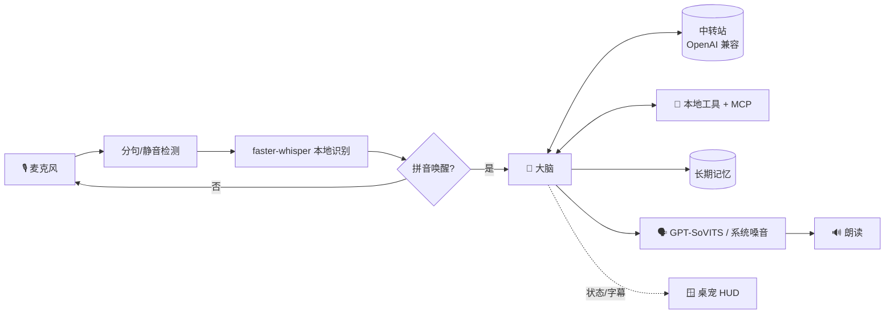

<div align="center">

# 🤖 HoloJarvis

**你电脑上的中文语音管家 —— 喊一声「贾维斯」，动口就办事。**

本地语音识别 · 任意大模型（中转站/DeepSeek/GPT…）· 工具调用 · 克隆音发声 · 钢铁侠风格全息桌宠

[](https://www.python.org/)
[](#-快速开始)
[](./LICENSE)

**简体中文** · [English](./README.en.md)


<sub>演示：喊「贾维斯」→ 聆听 → 思考 → 用克隆音回答，HUD 反应堆随状态变色</sub>

</div>

---

## ✨ 这是什么

HoloJarvis 是一个跑在 **macOS / Windows** 上的**中文语音助手**，灵感来自电影里钢铁侠的 AI 管家。
你对着电脑喊「贾维斯」，它就醒来听你说话、理解意图、调用工具把事办了，再用语音回答你——
桌面上还浮着一块青色的全息控制台桌宠，实时显示时间、系统状态和对话字幕。

> 🪟 项目最初为 macOS 而生（原名 `jarvis-mac`），现已**同一套代码跨平台**支持 Windows：
> 底层差异（语音合成、截屏、剪贴板、媒体/音量、回收站、系统遥测等）按系统自动切换，集中在 `jarvis/winops.py`。

它的大脑接的是 **OpenAI 兼容接口**，所以你可以用**自己的中转站**接入任意模型
（DeepSeek、GPT、Claude……），按需切换；嗓音可选接入 **GPT-SoVITS 克隆音**，让它用你想要的声音说话。

> 💡 这是一个个人项目，面向喜欢折腾、想要一个「本地可控、越用越懂你」的桌面语音助手的玩家。

## 🌟 特性

- 🎙️ **本地语音识别** —— 用 [faster-whisper](https://github.com/SYSTRAN/faster-whisper) 在本地转写，不上传你的声音。
- 🔑 **拼音模糊唤醒** —— 喊「贾维斯」即可唤醒，识别成「家维斯/贾卫师」等同音也能命中；并做了噪音幻听过滤，防止电视声误唤醒。
- 🧠 **任意大模型** —— 通过你的中转站（OpenAI 兼容）接入 DeepSeek / GPT / Claude 等，改一行配置即可换模型。
- 🧰 **23 个内置工具 + MCP 扩展** —— 开应用、查天气、控制音乐、读屏幕、管理记忆、审核文件修改、整理文件、设倒计时…… 还能通过 [MCP](https://modelcontextprotocol.io/) 接入更多能力。
- 🗣️ **克隆音发声** —— 可选接入 [GPT-SoVITS](https://github.com/RVC-Boss/GPT-SoVITS)，用克隆嗓音朗读；服务没开时自动回退到系统 `say`。
- 🧬 **长期记忆** —— 说「记住…」它就跨重启记住你的名字、偏好、习惯，越用越懂你。
- 🪟 **全息桌宠 HUD** —— 钢铁侠风格的青色控制台：弧形反应堆随状态变色、时钟天气、磁盘/电量/CPU 遥测、对话字幕、笔记栏。点反应堆即可说话。
- 🌀 **3D 全息粒子控制台（`--holo`）** —— 用 `./run.sh --holo` 启动浏览器版形象：Three.js 万级粒子核心，摄像头手势控制（张手放大扩散、握拳聚拢、捏合切形态，球体/环体/DNA/星系/立方/头像六种形态），语音状态实时联动变色脉动、对话字幕、系统遥测。识别用 MediaPipe 本地模型，运行不依赖外网。
- 🔒 **本地可控** —— 识别、桌宠、记忆都在本地；大模型走你自己的中转站，密钥配置全部留在本机、不进仓库。

## 🧱 架构



| 模块 | 文件 | 职责 |
|---|---|---|
| 主循环 | `jarvis/__main__.py` | 唤醒、状态机、把各模块串起来 |
| 识别 | `jarvis/asr.py` `jarvis/audio.py` | 麦克风 + faster-whisper |
| 大脑 | `jarvis/brain.py` | 调中转站、工具调用循环、多步任务 |
| 工具 | `jarvis/tools.py` `jarvis/mcp_bridge.py` | 本地工具 + MCP 工具 |
| 记忆 | `jarvis/memory.py` | SQLite `memory.db`（自动导入旧 `memory.json`） |
| 任务 | `jarvis/tasks.py` | 本地 SQLite `tasks.db` 任务看板 |
| 发声 | `jarvis/tts.py` | GPT-SoVITS 克隆音 / 系统嗓音（say · SAPI）|
| 桌宠 | `jarvis/pet.py` | 全息 HUD（tkinter + Pillow）|
| 平台 | `jarvis/winops.py` | Windows 底层操作（剪贴板/媒体/截屏/回收站/遥测…）|
| 配置 | `jarvis/config.py` | 集中读取各项配置 |

## 🚀 快速开始

> 需要 **Python 3.12**（macOS 或 Windows 均可）。首次运行会下载 Whisper 模型，请耐心等待。

<details open>
<summary><b>🍎 macOS</b></summary>

```bash
# 1) 克隆
git clone https://github.com/wqq64842-commits/holojarvis.git
cd holojarvis

# 2) 建虚拟环境并装依赖
python3.12 -m venv .venv
source .venv/bin/activate
pip install -r requirements.txt

# 3) 配置中转站（OpenAI 兼容网关）
cp base_url.txt.example base_url.txt   # 填你的中转站地址，如 https://xxx/v1
cp api_key.txt.example  api_key.txt    # 填你的 API Key
cp model.txt.example    model.txt      # 选模型，如 deepseek-v4-flash

# 4) 启动（带桌宠）
./run.sh
# 或纯命令行：./run.sh --no-pet
```

> ⚠️ 首次运行 macOS 会弹窗申请**麦克风**权限；部分工具（截屏/读屏/发微信）还需要在
> 「系统设置 → 隐私与安全性」里授予**屏幕录制**、**辅助功能**权限。
</details>

<details>
<summary><b>🪟 Windows 10/11（小白详细版）</b></summary>

> 支持 Windows 10/11 64 位。首次安装依赖和首次下载 Whisper 模型都需要联网。

#### 1. 安装 Python 3.12

1. 打开 [Python Windows 下载页面](https://www.python.org/downloads/windows/)，下载 Python 3.12 的
   **Windows installer (64-bit)**。
2. 运行安装程序，务必勾选 **Add python.exe to PATH**，然后点击 **Install Now**。
3. 安装完成后打开 PowerShell，检查版本：

```powershell
py -3.12 --version
```

正常情况下会显示 `Python 3.12.x`。如果提示找不到 `py`，请重新安装 Python 3.12，并确认勾选了
**Add python.exe to PATH**。

#### 2. 下载 HoloJarvis

不熟悉 Git 的用户：

1. 点击仓库页面右上方绿色的 **Code** 按钮；
2. 选择 **Download ZIP**；
3. 解压到简单路径，例如 `C:\HoloJarvis`。

熟悉 Git 的用户也可以执行：

```powershell
git clone https://github.com/wqq64842-commits/holojarvis.git
cd holojarvis
```

#### 3. 在项目目录打开 PowerShell

进入解压后的 HoloJarvis 文件夹，在文件夹空白处点击鼠标右键，选择
**在终端中打开**。也可以手动进入目录：

```powershell
cd C:\HoloJarvis
```

#### 4. 创建独立环境并安装依赖

下面的命令不需要激活虚拟环境，因此不会遇到 PowerShell 脚本执行策略问题：

```powershell
# 创建 Python 虚拟环境
py -3.12 -m venv .venv

# 更新 pip
.\.venv\Scripts\python.exe -m pip install --upgrade pip setuptools wheel

# 安装 HoloJarvis 依赖（可能需要几分钟）
.\.venv\Scripts\python.exe -m pip install -r requirements.txt
```

#### 5. 创建并填写模型配置

复制示例配置：

```powershell
Copy-Item base_url.txt.example base_url.txt
Copy-Item api_key.txt.example api_key.txt
Copy-Item model.txt.example model.txt
```

用记事本逐个打开：

```powershell
notepad base_url.txt
notepad api_key.txt
notepad model.txt
```

每个文件只填写一行，不要加引号：

| 文件 | 示例内容 | 说明 |
|---|---|---|
| `base_url.txt` | `https://你的中转站地址/v1` | OpenAI 兼容接口地址，一般以 `/v1` 结尾 |
| `api_key.txt` | `sk-xxxxxxxx` | 你的中转站或模型服务 API Key |
| `model.txt` | `deepseek-v4-flash` | 服务端支持的模型名称 |

> 🔒 API Key 属于私密信息。不要截图、发给别人或提交到 GitHub；这些本地配置已经加入 `.gitignore`。

#### 6. 测试模型连接

```powershell
.\.venv\Scripts\python.exe test_llm.py
```

如果终端显示模型回复，说明地址、API Key 和模型名称配置正确。如果出现 `401`，通常是 API Key 错误；
如果出现 `404`，请检查接口地址是否需要 `/v1`，以及模型名称是否正确。

#### 7. 启动 HoloJarvis

```powershell
# 桌面 HUD 模式
.\run.bat

# 3D 全息浏览器模式
.\run.bat --holo

# 纯命令行模式
.\run.bat --no-pet

# 纯文字模式（不加载麦克风、Whisper、TTS）
.\run.bat --text

# 只做启动自检，不启动助手
.\run.bat --check
```

首次启动会自动下载 Whisper 语音识别模型，可能需要几分钟。下载期间请保持网络连接，不要关闭窗口。

#### 8. 开启麦克风权限

打开 **Windows 设置 → 隐私和安全性 → 麦克风**，确保以下开关已经开启：

- 麦克风访问权限；
- 允许应用访问麦克风；
- 允许桌面应用访问麦克风。

系统朗读使用 Windows 内置 **SAPI**。如果能识别你的声音但没有语音回复，请检查系统扬声器是否静音，
并前往 **设置 → 时间和语言 → 语音** 安装中文语音。

#### 常见问题

**依赖安装失败**

先重新升级安装工具，再安装依赖：

```powershell
.\.venv\Scripts\python.exe -m pip install --upgrade pip setuptools wheel
.\.venv\Scripts\python.exe -m pip install -r requirements.txt
```

**Whisper 模型下载失败**

- 检查网络连接后重新运行，已经下载的缓存通常可以继续使用；
- 如果使用代理，请检查代理地址和端口是否合法；
- 下载阶段不要关闭 PowerShell 窗口。

**更新 HoloJarvis**

Git 用户可以执行：

```powershell
git pull
.\.venv\Scripts\python.exe -m pip install -r requirements.txt
```

使用 ZIP 的用户可以下载新版 ZIP，并把自己的 `base_url.txt`、`api_key.txt`、`model.txt`、
`memory.db`（旧版也可复制 `memory.json`）、`tasks.db` 和 `notes.txt` 复制到新目录。发微信功能依赖已登录的微信客户端，并通过界面自动化完成操作。
</details>

启动后喊一声「**贾维斯**」，或用鼠标点一下桌宠中央的反应堆，就能开始对话。

### 🗣️（可选）接入克隆音

默认用系统中文音 `say` 发声，零配置即可用。想要克隆嗓音：

1. 按 [GPT-SoVITS](https://github.com/RVC-Boss/GPT-SoVITS) 文档部署，启动它的 `api_v2`，监听 `127.0.0.1:9880`；
2. 准备一段参考音频（几秒你想要的嗓音），设置环境变量：
   ```bash
   export JARVIS_TTS=gptsovits
   export GPTSOVITS_REF=/绝对路径/你的参考音频.wav
   export GPTSOVITS_PROMPT="参考音频里说的那句话"
   ```
3. 重新 `./run.sh`。连不上 9880 时会自动回退到 `say`，不影响使用。

> 💡 Apple 芯片可把 GPT-SoVITS 的 `device` 设为 `mps` 用 GPU 加速，合成快 2~3 倍。

## ⚙️ 配置说明

所有敏感配置都放在项目根目录的几个文本文件里（已被 `.gitignore` 排除，不会进仓库）：

| 文件 | 作用 | 必填 |
|---|---|---|
| `base_url.txt` | 中转站地址（填到 `/v1`） | ✅ |
| `api_key.txt` | 中转站 / LLM 的 API Key | ✅ |
| `model.txt` | 模型名（默认 `deepseek-v4-flash`） | ⬜ |
| `mcp.json` | MCP 工具配置 | ⬜ |
| `notes.txt` | HUD 笔记栏内容 | ⬜ |

也支持用环境变量覆盖（优先级更高）：`JARVIS_BASE_URL`、`JARVIS_API_KEY`、`JARVIS_MODEL`、
`JARVIS_MAX_TOKENS`、`JARVIS_CLOUD_MEMORY`、`JARVIS_TTS`、`JARVIS_VOICE`、`JARVIS_WHISPER` 等，详见 `jarvis/config.py`。
Windows 默认声音设备不正确时，可用 `JARVIS_OUTPUT_DEVICE` 指定输出设备编号或名称片段，例如 `Conexant SmartAudio HD`。
Windows USB 麦克风若在系统录音机正常、但 Python 录不到声音，可设置 `JARVIS_AUDIO_BACKEND=soundcard`；低电平设备可用 `JARVIS_MIC_THRESHOLD` 调整触发阈值（默认 `400`）。
USB 麦克风有短暂断流、导致一句话被过早切断时，可调高 `JARVIS_SILENCE_TAIL`（秒）。
`soundcard` 兼容后端使用 5 秒连续采集块以兼容老 USB 驱动，因此响应可能比默认后端慢约 5 秒。

如果没有配置 `JARVIS_BASE_URL` 或 `base_url.txt`，启动时会自动探测本机 Ollama
（`127.0.0.1:11434`），发现已下载模型后直接使用，不要求 API Key，也不会覆盖已有云端配置。
对话默认保留最近 12 个完整用户轮次，可用 `JARVIS_HISTORY_TURNS` 调整。
CPU 本地模型可将 `JARVIS_MAX_TOKENS` 调低到 `256`，缩短简短语音回复的等待时间。

> 🔧 **换模型**：改 `model.txt` 一行，重启即可。建议选**支持工具调用**的模型，
> 否则开应用/读屏幕/记忆等能力会失效。

## 🧰 内置工具

| 工具 | 说明 |
|---|---|
| `open_app` / `open_url` / `web_search` | 打开应用、网址、搜索 |
| `get_time` / `get_weather` | 报时、查天气 |
| `control_music` / `set_volume` | 控制 Music、调音量 |
| `set_timer` | 倒计时语音提醒 |
| `take_screenshot` / `read_screen` | 截屏、看屏幕内容并总结 |
| `send_wechat` | 微信发消息（发送前会先口头确认；macOS / Windows 均支持） |
| `system_power` | 锁屏 / 休眠 |
| `remember` / `list_memories` | 按核心、长期、项目分类写入和查看记忆 |
| `update_memory` / `forget` / `clear_memories` | 修改、按关键词删除或清空记忆（需确认） |
| `export_memories` | 导出 JSON 到 `workspace/`（需确认） |
| `read_text_file` / `propose_file_change` | 确认后读取文本，并生成不直接落盘的文件修改提案 |
| `list_directory` / `run_shell` / `move_to_trash` | 多步文件任务（删除走废纸篓，更安全） |

会话记忆是当前对话最近若干轮，`/reset` 后清空；`core`、`long_term` 和 `project`
保存在 SQLite 中并跨重启保留。修改、导出和清空属于高风险操作，需先启用危险工具，且每次仍要单独确认。

使用云模型时，当前对话和调用产生的工具结果会发送到模型接口；持久记忆默认不发送。
如需授权指定分类，可在启动前设置，例如：

```powershell
$env:JARVIS_CLOUD_MEMORY = "core,project"
```

也可设为 `all` 或 `none`。本机回环地址（`localhost`、`127.0.0.1`、`::1`）默认允许全部分类。
每次启动或运行 `python -m jarvis --check --text` 都会显示实际发送范围，无效配置会阻止启动。

### 本地任务看板

文字模式支持以下本地命令，它们不会发送给模型：

```text
/task add 完成项目说明
/task list
/task start 1
/task progress 1 25 已完成需求分析
/task remind 1 2026-08-28 09:00 开始前检查附件
/task reminders
/task unremind 1
/task done 1
/task reopen 1
/task list all
```

任务状态为 `todo`、`doing`、`done`；默认列表只显示未完成任务。进度达到 100% 会自动完成任务；
已完成任务需要先 `reopen` 才能降低进度。

每个未完成任务可保存一个本地绝对时间提醒。文字模式运行期间会在到点后约 1 秒内显示一次，
重启后仍会恢复未提醒项目；完成任务会自动取消其提醒。提醒数据不会发送给模型。

### 文件修改审核

智能体只能为 `workspace/` 内不超过 256 KiB 的 UTF-8 文本生成待审提案，接受前不会修改原文件。
读取原文件属于高风险操作，需要启用危险工具并单独确认。审阅使用本地文字命令：

```text
/diff list
/diff show 1
/diff accept 1
/diff reject 1
```

接受成功会生成本地撤销记录：

```text
/undo list
/undo show 1
/undo apply 1
```

接受或撤销前如果目标文件已变化，系统会拒绝覆盖并保留相应记录。首版不支持二进制文件、
逐块接受、多文件事务、重复撤销或 redo。

## 🔌 MCP 扩展

编辑 `mcp.json` 即可接入 [MCP](https://modelcontextprotocol.io/) 服务器（文件系统、浏览器自动化、网页抓取等），
仓库内已带文件系统示例。MCP 仍默认由 `JARVIS_ENABLE_MCP` 全局关闭；启用后，每台服务器还必须
为每个工具配置权限：

```json
"permissions": {
  "read_text_file": "allow",
  "write_file": "confirm"
}
```

`allow` 可直接调用，`confirm` 必须跨轮一次性确认，未列出的工具默认拒绝且不会提供给模型。
权限表缺失、为空或含非法值时，该服务器不会启动。启动日志会显示实际允许、需确认和拒绝的数量。
浏览器付款等代码级强制确认不能通过配置降级。

文字模式可随时查看 Skill 来源与当前权限；命令完全在本地处理，不发送给模型，也不会显示 MCP 的
环境变量或密钥：

```text
/skills
/skills builtin
/skills mcp
```

当前项目把可执行 Skill 定义为内置工具和 MCP 工具；尚未引入独立的 `SKILL.md` 安装器。

文件系统示例已限制到 `workspace/` 且仅开放读取工具；写入、移动和删除工具默认不暴露。

### 发布前验收

```powershell
.\.venv\Scripts\python.exe scripts\release_check.py
```

自动检查通过后，还需完成 [真实设备与发布清单](docs/RELEASE_CHECKLIST.md)；不要从包含未提交改动的工作树发布。

浏览器示例默认关闭。启用前需同时设置 `$env:JARVIS_ENABLE_MCP = "1"`，并把
`_示例_隔离浏览器.enabled` 改为 `true`。该配置使用内存临时 profile，工作目录固定为
`workspace/`，下载等输出只写入 `workspace/browser-output/`；不会读取 Chrome/Edge 的现有登录态。
桥接层会拒绝移除隔离、接管浏览器、关闭沙箱或允许工作区外文件访问的 Playwright 配置。

文件上传只允许选择 `workspace/` 内的真实文件。上传、所有网页点击、Enter/Space 提交、
`submit=true`、接受网页确认框以及浏览器脚本执行都会先暂停，用户必须在下一轮明确回复
“确认执行”；确认只对当前动作生效，取消或其他输入会作废，并写入不含参数正文的本地审计。

## 🗺️ 路线图

- [x] Windows 支持（同一套代码跨平台）
- [ ] 开机自启（macOS launchd / Windows 计划任务）
- [ ] 桌宠点击穿透 / 可调透明度
- [ ] 更多内置工具（日历、提醒事项、邮件）
- [ ] 真实麦克风电平驱动波形

欢迎 Issue / PR 一起折腾，详见 [贡献指南](./CONTRIBUTING.md)。

## 🙏 致谢

- [GPT-SoVITS](https://github.com/RVC-Boss/GPT-SoVITS) —— 少样本克隆音
- [faster-whisper](https://github.com/SYSTRAN/faster-whisper) —— 本地语音识别
- [Model Context Protocol](https://modelcontextprotocol.io/) —— 工具扩展协议
- [skyfireitdiy/Jarvis](https://github.com/skyfireitdiy/Jarvis) —— 同名项目，README 形态参考

## 📄 License

[MIT](./LICENSE) © 2026 wang64862
